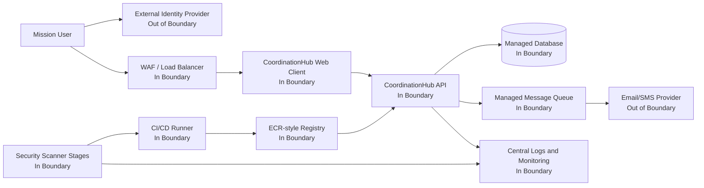
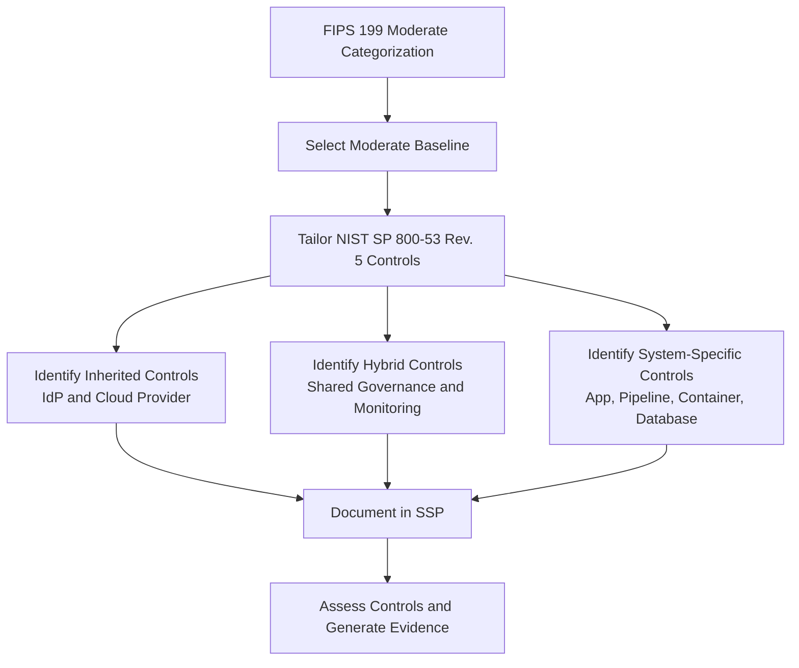
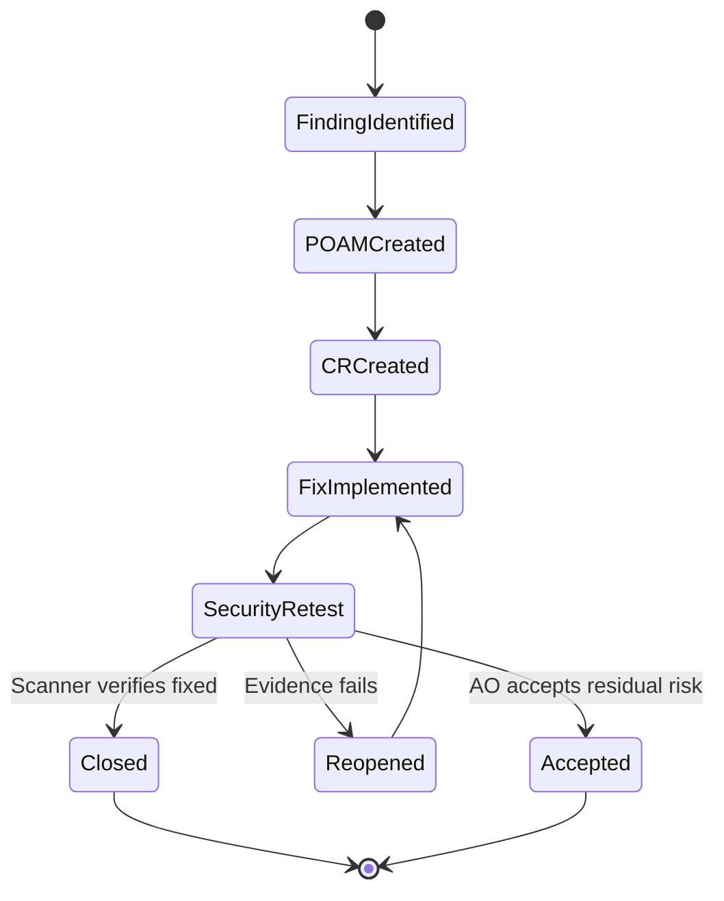
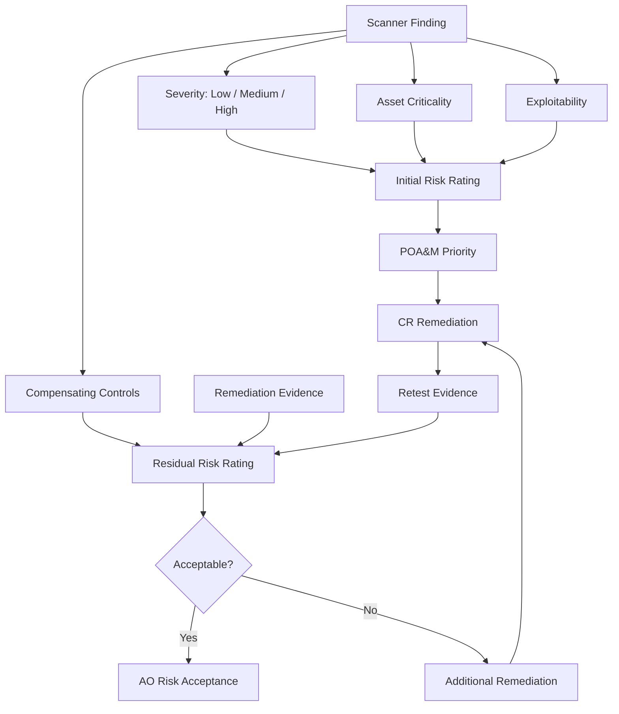
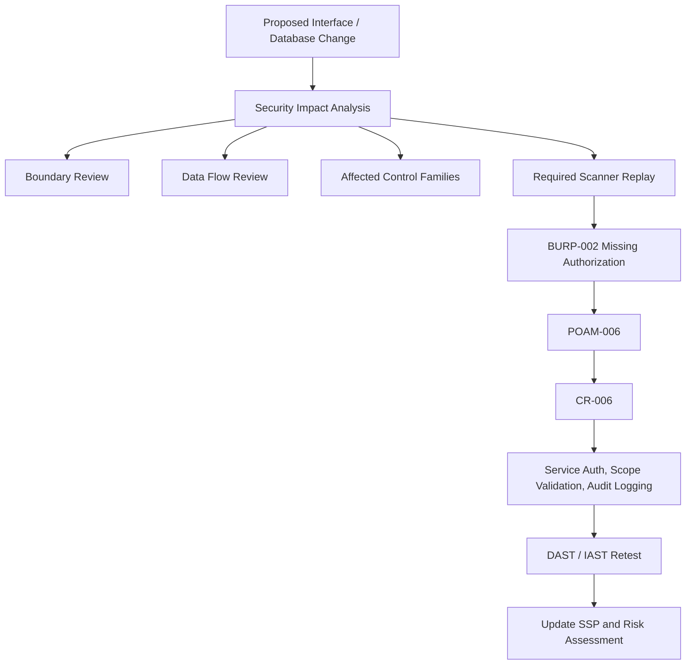

# Sample SCA Baselining Project

This repository is a self-contained mock Security Control Assessment (SCA) baselining package for a cloud-hosted communication and coordination application named **CoordinationHub**.

CoordinationHub is a simple sample system used by mission teams to exchange messages, coordinate tasks, and track operational decisions. The repository shows how a security team could baseline the system, define an authorization boundary, tailor NIST SP 800-53 controls, run mocked scanner stages, generate POA&Ms, route fixes through change requests (CRs), and document residual risk for authorization.

This is a training/sample package only. It is not an official authorization package.

## What This Project Demonstrates

- Cloud authorization boundary definition and mocked asset inventory.
- NIST SP 800-53 Rev. 5 control tailoring for a moderate-impact sample system.
- A sample System Security Plan (SSP).
- Mock scanner integrations for Veracode, Burp Suite, Contrast, Aqua, and ECR/container image scanning.
- Vulnerable code examples and patched versions linked to CRs.
- POA&M generation, remediation, risk reduction, and residual risk reporting.
- Security Impact Analysis (SIA), security test plan, security test report, risk assessment, and gap analysis.
- Release reporting for Low, Medium, and High POA&M remediation counts.

## Repository Layout

```text
app/
  vulnerable/          Example vulnerable service code and container baseline
  patched/             Remediated service code and hardened container baseline
architecture/          Authorization boundary, inventory, and cloud data flow docs
controls/              NIST 800-53 tailoring and SSP traceability
scanners/              Mock scanner outputs and scanner stage definitions
poam/                  POA&M register, remediation plan, and risk reduction report
change-requests/       CR records for patched findings and SIA-driven changes
reports/               Security test, risk, SIA, release, and gap analysis reports
pipeline/              Mock DevSecOps workflow stages
scripts/               Local report validation/generation helpers
```

## Walkthrough

Use this package as a miniature RMF/SCA lifecycle. Start with the cloud system boundary, read the tailored control set, inspect the vulnerable code and scanner findings, then follow each finding through POA&M creation, CR remediation, retesting, and residual-risk reporting.

Suggested reading order:

1. `architecture/authorization-boundary.md`
2. `architecture/inventory.csv`
3. `controls/control-tailoring.md`
4. `controls/ssp.md`
5. `app/vulnerable/`
6. `scanners/mock-scan-results.json`
7. `poam/poam-register.csv`
8. `change-requests/`
9. `app/patched/`
10. `scanners/mock-rescan-results-r1.0.1.json`
11. `reports/security-test-report.md`
12. `reports/risk-assessment-gap-analysis.md`

## Cloud Authorization Boundary

The sample authorization boundary contains the application, its data tier, its DevSecOps pipeline, container registry, logging, and monitoring components. External identity and notification services are shown as inherited or out-of-boundary dependencies.



Boundary decisions are documented in `architecture/authorization-boundary.md`, and asset ownership is mocked in `architecture/inventory.csv`.

## Control Tailoring Logic

The project uses a moderate-impact sample baseline and focuses on controls that matter to cloud application security, container hardening, scanning, flaw remediation, configuration management, and continuous monitoring.



Primary tailored families include:

- `AC`: access control and authorization enforcement.
- `AU`: audit logging and review.
- `CA`: assessment, authorization, continuous monitoring, and POA&M management.
- `CM`: baseline configuration, change control, and security impact analysis.
- `IA`: identification, authentication, and credential handling.
- `RA`: vulnerability scanning and risk assessment.
- `SA`: developer security testing.
- `SC`: boundary protection and transmission security.
- `SI`: flaw remediation and system monitoring.

See `controls/control-tailoring.md` and `controls/ssp.md`.

## Vulnerable Baseline

The vulnerable baseline intentionally includes a few common weaknesses:

| Finding | Example Location | Mock Scanner | Severity |
| --- | --- | --- | --- |
| SQL injection | `app/vulnerable/.../MessageController.java` | Veracode | High |
| Stored XSS | `app/vulnerable/.../MessageController.java` | Burp Suite | Medium |
| Forged role header authorization | `app/vulnerable/.../MessageController.java` | Contrast | Medium |
| Root container and old base image | `app/vulnerable/Dockerfile` | Aqua | High |
| Static default secret pattern | `app/vulnerable/Dockerfile` | ECR Image Scan | Low |

The baseline scanner output is stored in `scanners/mock-scan-results.json`.

## DevSecOps Scanner Workflow

The pipeline file `pipeline/devsecops-stages.yml` mocks a release flow where scanner gates feed POA&M and CR decisions.

```mermaid
flowchart LR
    code[Source Code] --> build[Build Container]
    build --> sast[Veracode SAST]
    sast --> dast[Burp Suite DAST]
    dast --> iast[Contrast IAST]
    iast --> aqua[Aqua Container Scan]
    aqua --> ecr[ECR Image Scan]
    ecr --> poam[Generate or Update POA&Ms]
    poam --> cr[Create CRs for Fixes]
    cr --> board[CR Board Review]
    board --> deploy[Approved Deployment]
    deploy --> report[Release LMH Report]
```



Gate logic:

- High findings block release unless remediated or formally accepted.
- Medium findings require remediation before production in this sample.
- Low findings may be accepted if compensating monitoring and AO approval are documented.

## POA&M and CR Lifecycle

Every scanner finding becomes a POA&M item. Each remediation is tied to a CR so the security, engineering, and change-management story stays traceable.



Traceability example:

| POA&M | Finding | CR | Fix |
| --- | --- | --- | --- |
| POAM-001 | VER-001 SQL injection | CR-001 | Prepared statement |
| POAM-002 | BURP-001 stored XSS | CR-002 | HTML output encoding |
| POAM-003 | CON-001 authz bypass | CR-003 | Validated principal and MFA check |
| POAM-004 | AQUA-001 root container | CR-004 | Supported non-root container image |
| POAM-005 | ECR-001 static secret | CR-005 | Secret removed and monitored |

See `poam/poam-register.csv` and `change-requests/`.

## Risk Management Logic

The sample uses a simple qualitative risk model:

```text
Risk = Likelihood x Impact
```

Scanner severity, exploitability, affected asset criticality, and compensating controls are used to determine the before and after risk level.



Risk reduction shown in this sample:

| Release | High | Medium | Low | Overall Risk |
| --- | ---: | ---: | ---: | --- |
| R1.0.0 baseline | 2 | 2 | 1 | High |
| R1.0.1 after remediation | 0 | 0 | 1 accepted | Low |

The R1.0.1 release is documented as acceptable with AO approval because high and medium sample risks are remediated and the remaining low risk has compensating monitoring.

## SIA Workflow for Interface and Database Change

The SIA example models a new external partner receipt interface and a new database table. The change affects the authorization boundary, data flow, database schema, logging, and control implementation details.



Affected control families for the SIA example:

- `AC`: partner API access enforcement.
- `AU`: audit records for partner interface events.
- `CM`: controlled change and impact analysis.
- `IA`: partner credential handling.
- `RA`: scanning of the new endpoint and data path.
- `SC`: boundary protection and secure transmission.
- `SI`: flaw remediation and monitoring.

See `reports/security-impact-analysis.md` and `change-requests/CR-006-sia-partner-interface.md`.

## Security Assessment Artifacts

The assessment package includes:

| Artifact | Purpose |
| --- | --- |
| `reports/security-test-plan.md` | Defines control-focused security test procedures. |
| `reports/security-test-report.md` | Records R1.0.1 assessment results and exceptions. |
| `reports/risk-assessment-gap-analysis.md` | Summarizes risk, gaps, and residual-risk decisions. |
| `reports/security-impact-analysis.md` | Documents the SIA for a new interface/database change. |
| `reports/release-r1.0.1-lmh-summary.md` | Summarizes Low/Medium/High POA&M outcomes for release approval. |

## Quick Start

Run the local summary generator:

```powershell
py scripts/generate_release_report.py
```

Expected output:

```text
Release R1.0.1 fixed 5 POA&Ms: High=2 Medium=2 Low=1
Residual risk: Low / Acceptable with AO approval
POA&Ms included: POAM-001, POAM-002, POAM-003, POAM-004, POAM-005
```

If `py` is unavailable and Python is installed as `python`, use:

```powershell
python scripts/generate_release_report.py
```

## DevOps Cadence Pipeline

This repo includes a scheduled GitHub Actions pipeline at `.github/workflows/devsecops-cadence.yml`.

Cadence:

- Weekly continuous monitoring package: every Monday at 09:00 UTC.
- Monthly authorization evidence package: first day of each month at 10:00 UTC.
- Manual release package: run `DevSecOps Cadence` with `cadence=release`.

The pipeline validates the release summary generator, builds a timestamped SCA evidence package, and uploads the generated package as a GitHub Actions artifact with 90-day retention.

Run the artifact generator locally:

```powershell
py scripts/generate_cadence_artifacts.py --cadence weekly
py scripts/generate_cadence_artifacts.py --cadence monthly
py scripts/generate_cadence_artifacts.py --cadence release
```

Generated packages are written under:

```text
artifacts/cadence/<UTC timestamp>-<cadence>/
```

The cadence configuration and artifact inventory are documented in `pipeline/cadence-plan.yml`.

## NIST Reference Notes

Primary references used for this sample:

- NIST SP 800-53 Rev. 5, including updates through Release 5.2.0.
- NIST SP 800-37 Rev. 2 for RMF framing, continuous monitoring, authorization, and change impact concepts.
- NIST SP 800-18 Rev. 1 is referenced historically for SSP format concepts, but it was withdrawn on June 30, 2026 and superseded by SP 800-18 Rev. 2.
